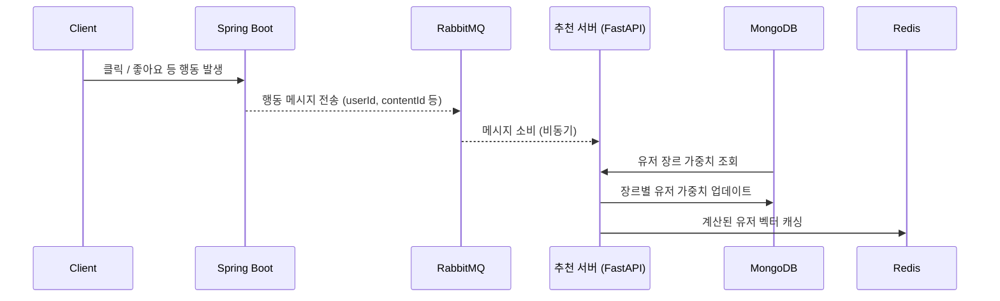

# ✨ 추천 서버 (Recommendation Server)
 
사용자의 실시간 행동 로그를 기반으로 개인화된 콘텐츠를 추천하기 위한 유저 벡터 연산과 가중치 업데이트를 하는 서버입니다.
Low latency추천 응답과 유연한 추천 파이프라인 구성을 목표로 합니다.

 
 

## 🔁 데이터 흐름 예시
 

사용자 행동 발생 시, 추천 시스템은 다음과 같은 흐름으로 동작합니다:

>💡 사용자 벡터는 Redis에 캐시되어 있으며, 추천 요청 시 PGVector의 콘텐츠 벡터와의 유사도 연산으로 빠르게 추천 결과를 반환합니다.

 

##

## 🛠 기술 스택

  
  
  
  
  

